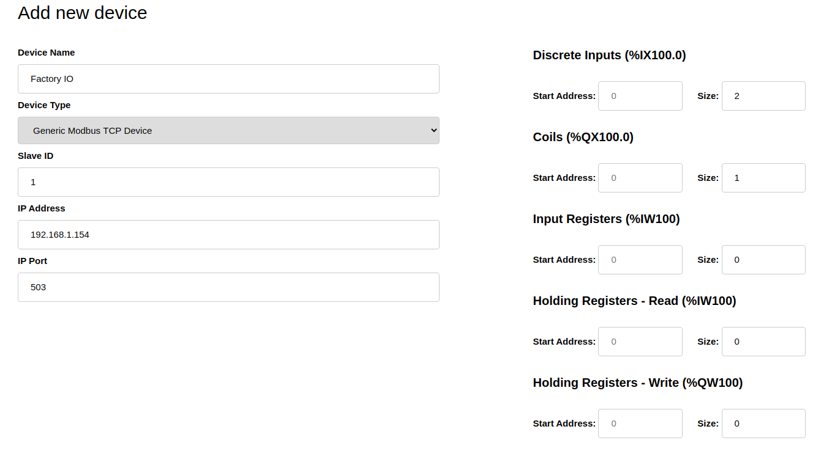

# FactoryIO_RPI_PLC
Turn a Raspberry Pi into a PLC to control Factory I/O processes running on a separate computer.  

## Prerequisites
- A raspberry pi Running the latest version of Raspberry Pi OS
- A monitor to access the GUI of the raspberry pi
- OpenPLC Runtime installed on the Pi: [link](https://www.openplcproject.com/runtime/raspberry-pi/)
- The ability to connect the Pi to a computer running Factory I/O (i.e. CAT 5 Ethernet cable)
- FactoryIO installed on a separate computer. You can use the trial version or paid version.

## Initial Network Setup
1. Set a static IP address on eth0 of the raspberry pi

	`sudo nano /etc/dhcpcd.conf`

	Set the ip address of eth0 to a private IP address of your choosing. For example, you can include the following lines at the bottom of the file:

	`interface eth0
	static ip_address=192.168.1.124/24`

	Write Out and exit

2. Set a static IP address on the ethernet interface on your laptop IP address in the same subnet as the raspberry pi (i.e. 192.168.1.154).

	Windows how-to: [link](https://pureinfotech.com/set-static-ip-address-windows-10/)

	Mac how-to: [link](https://kb.netgear.com/000037250/Setting-a-static-IP-address-on-your-network-adapter-in-Mac-OS-for-direct-access-to-an-access-point)

	Make sure the subnet mask matches the CIDR notation on the raspberry pi. In this case **/24** would take a subnet mask of **255.255.255.0**

3. Connect the two devices via ethernet cable and test the connection

	From from a shell on the computer, ping the raspberry pi:

	`ping 192.168.1.124`

	If the IP configuration has been setup properly your ping should be successful. *Note: If you try pinging a windows computer from the raspberry pi you may be blocked by the windows firewall. As long as you can ping the pi, you are good.*

## Factory I/O Configuration

To make things simple, we will start with the first sample scene which involves moving a box along a conveyor belt until it reaches a sensor. The only things you'll want to add to the scene is a start button.

1. Launch Factory I/O and open scene "1 - From A to B"

2. Add a start button to the scene

3. Setup Modbus TCP/IP Server

	In the top left of the screen select File->Drivers
	
	From the Dropdown select "Modbus TCP/IP Server"

	Click CONFIGURATION in the top right

	Change the Port to 503 to deconflict with OpenPLC and ensure the network adapter is the one you set previously and have connected to the pi

4. Adjust the sensors to the configuration shown below

## OpenPLC Runtime Configuration

On the raspberry pi you will need to login to the OpenPLC Runtime portal from a browser which is at localhost:8080 by default. From here we will go about setting the Factory I/O conveyor belt process as a slave device.

1. On the left-hand nav bar select Slave Devices and then "Add New Device"

2. Configure as follows:

	

	*Note: The Slave ID must match the one on Factory I/O*

	*Note: The IP and Port must match the ones from Factory I/O*

	
## References

helpful forum post: https://openplc.discussion.community/post/openplc-vs-factory-io-10065556?pid=1307886792&highlight=factoryio

