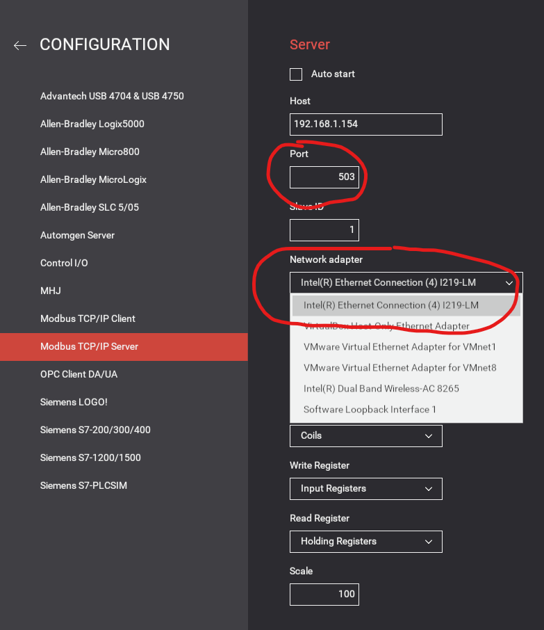

# FactoryIO_RPI_PLC
Turn a Raspberry Pi into a PLC to control Factory I/O processes running on a separate computer.  

## Prerequisites
- A raspberry pi running the latest version of Raspberry Pi OS.
- OpenPLC Runtime installed on the pi: [link](https://www.openplcproject.com/runtime/raspberry-pi/).
- The ability to connect the pi to a computer running Factory I/O (i.e. CAT 5 Ethernet cable).
- FactoryIO installed on a separate computer. You can use the trial version or paid version.
- (Optional) A monitor to access the GUI of the raspberry pi. *Otherwise you can use SSH for pi configuration*

## Initial Setup
1. (Optional) Clone this respository to your computer.

2. Set a static IP address on eth0 of the raspberry pi.

	From the shell (terminal) on the pi run:

	`sudo nano /etc/dhcpcd.conf`

	Set the ip address of eth0 to a private IP address of your choosing by adding it to the *dhcpcd.conf* file. For example, you can add the following lines at the bottom of the file:

	```
	interface eth0
	static ip_address=192.168.1.124/24
	```

	Write Out and exit.

3. Set a static IP address on the ethernet interface of your laptop in the same subnet as the raspberry pi (i.e. 192.168.1.154).

	Windows how-to: [link](https://pureinfotech.com/set-static-ip-address-windows-10/).

	Mac how-to: [link](https://kb.netgear.com/000037250/Setting-a-static-IP-address-on-your-network-adapter-in-Mac-OS-for-direct-access-to-an-access-point).

	Make sure the subnet mask matches the CIDR notation on the raspberry pi. In this case **/24** would take a subnet mask of **255.255.255.0**.

4. Connect the two devices via ethernet cable and test the connection.

	From from a shell (command prompt) on the computer, ping the raspberry pi:

	`ping 192.168.1.124`

	If the IP configuration has been setup properly your ping should be successful. *Note: If you try pinging a Windows computer from the raspberry pi you may be blocked by the Windows Firewall. As long as you can ping the pi, you are good.*

## Factory I/O Configuration

To make things simple, we will utilize the first sample scene which involves moving a box along a conveyor belt until it reaches a sensor. The only things you'll want to add to the scene is a start button.

1. Launch Factory I/O and open scene "1 - From A to B".

2. Add a start button to the scene.

3. Setup Modbus TCP/IP Server.

	In the top left of the screen select File->Drivers.
	
	From the Dropdown select "Modbus TCP/IP Server".

	

	Click **CONFIGURATION** in the top right.

	Change the Port to 503 to deconflict with OpenPLC and ensure the network adapter is the one you set previously and have connected to the pi.

	

4. Adjust the sensors to the configuration shown below.

	

## OpenPLC Runtime Configuration

You will need to login to the OpenPLC Runtime portal. As long as your computer and pi are successfully connected, this can be done from the browser on your computer. If you used the IP scheme in this guide that would be 192.168.1.124:8080. From here we will go about setting the Factory I/O conveyor belt process as a slave device.

1. On the left-hand nav bar select **Slave Devices** and then **Add New Device**

2. Configure as follows:

	.

	*Note: The Slave ID must match the one on Factory I/O*.

	*Note: The IP and Port must match the ones from Factory I/O*.

3. Next you need to upload the program that will operate the conveyor process. You can use the prebuilt program included in this repository or you can use OpenPLC Editor to build it yourself. *A guide for building it yourself is linked below.*

	If you want to upload a precompiled program, you can use *programs/AtoB.st* in this repository.

	In OpenPLC Runtime select **Programs** from the nav bar, choose the file, and upload the program.

	-----
	If you want to create the program yourself you can use OpenPLC Editor. *The OpenPLC website has a great tutorial (linked below).*
	
	The program required is one of the basics of ladder logic, an output latch with stop. Just make sure to understand if your button or sensor is normally opened or normally closed, and what that means *(guide linked below)*. That knowledge will determine if you use **Examine if Closed** or **Examine if Open** in your logic.

	If you get stuck, you can open *editor_files/Conveyor_AtoB* in OpenPLC Editor to see the solution.

## Putting the Pieces Together

1. Start the Modbus TCP/IP Server on Factory I/O.

	

2. From the OpenPLC Runtime Dashboard, click **Start PLC** on the left nav bar.

	If done correctly, the Runtime Logs should display a successful connection to your modbus server on Factory I/O.

3. Switch the Factory I/O scene to run mode and click on your start button.

	The conveyor belt should turn on and stop once the box reaches the sensor.

4. CONGRATULATIONS!! You've successfully turned your raspberry pi into a PLC. 

## References

OpenPLC Runtime Raspberry Pi Installation: https://www.openplcproject.com/runtime/raspberry-pi/

Factory I/O: https://factoryio.com/

Great resource for learning OpenPLC Editor: https://www.openplcproject.com/reference/basics/first-project

Helpful forum post: https://openplc.discussion.community/post/openplc-vs-factory-io-10065556?pid=1307886792&highlight=factoryio

PLC Ladder Logic Tutorial (Basics): https://www.plcacademy.com/ladder-logic-tutorial/


